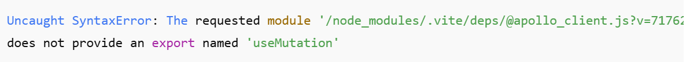

# GraphQL Users

A simple GraphQL project that demonstrates how to build a Users API with queries, mutations, and resolvers.

This project is perfect for learning GraphQL basics such as:

- Defining a schema

- Creating queries & mutations

- Handling user data

- Using a GraphQL server (Apollo)

## 🚀 Features

- Create, update, delete users

- Fetch all users or a single user

- Simple in-memory database

- GraphQL schema + resolvers

- Runs with Node.js

## 🛠 Tech Stack

- Node.js

- React

- Apollo Server 

- GraphQL

## 📦 Setup Instructions
1️⃣ Clone the project
- git clone https://github.com/yourusername/graphql-users.git
- cd graphql-users

2️⃣ Install dependencies
- npm install

3️⃣ Start the server
- Include "start": "node [entry file].js" in th script sction of package.json file
- Then run npm start

The server will run at:
👉 http://localhost:4000/graphql

## 🐛 Issue: Apollo Client Did Not Export useQuery and useMutation

While integrating Apollo Client with React, I encountered the following error:

### 🔍 Cause

This issue occurred because:

I was using React 19, which is not fully supported by Apollo Client.

Apollo Client v4+ does not exist, and the correct stable version is Apollo Client 3.x.

React 19 caused Vite to load a broken ESM build of @apollo/client, which was missing hooks like useQuery and useMutation.

### ✅ Solution

I solved this error by:

Downgrading React from 19 → 18

- npm uninstall react react-dom
- npm install react@18 react-dom@18

Installing a compatible Apollo Client version (3.x)

- npm install @apollo/client@3.10.0 graphql

After installing the correct versions, Apollo Client exports (useQuery, useMutation, gql, etc.) worked normally, and Vite no longer threw module errors.
